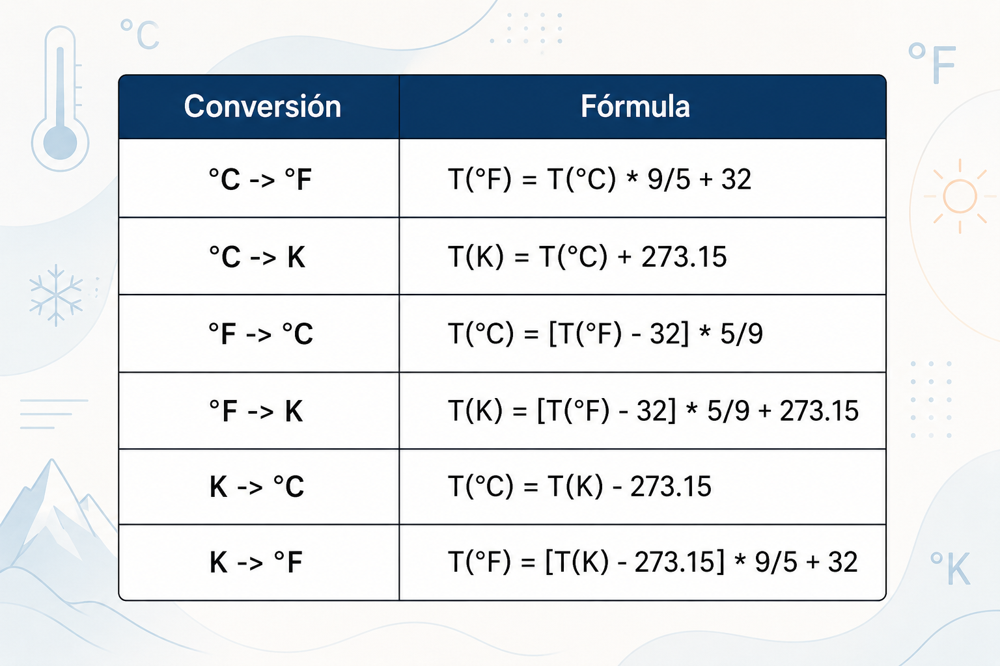

# Reto 1.2: Conversor de Escalas de Temperatura

En este nuevo reto, vamos a crear un conversor de escalas de temperatura entre grados Celsius (°C), Fahrenheit (°F) y Kelvin (K).

## Un poco de teoría

_La temperatura es una medida de la energía cinética promedio de los átomos o moléculas del sistema._ En palabras más sencillas, es una medida que nos indica qué tan frío o qué tan caliente se encuentra un objeto o el ambiente.

Disponemos de distintas escalas para medir temperatura:

- La escala __Celsius (°C)__ toma en cuenta el valor 0° para el punto de fusión del agua, mientras que el punto de ebullición del agua corresponde a 100°.
- La escala __Fahrenheit (°F)__ toma el punto de fusión del agua en 32 °F y el de ebullición en 212 °F.
- La escala __Kelvin (K)__ es la escala del cero absoluto, en la cual el punto de fusión del agua se da a 273 K y el punto de ebullición a 373 K.

Para la conversión entre estas escalas, vamos a tomar en cuenta la siguiente tabla.

